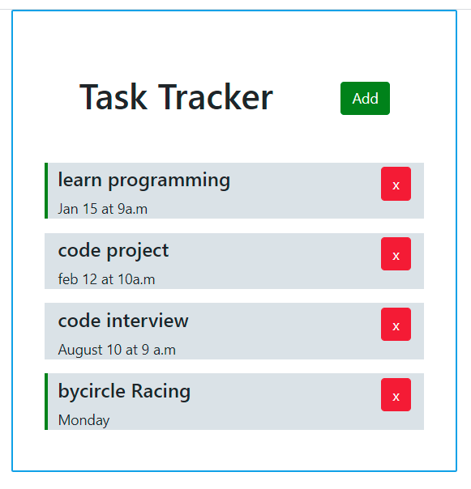

# Todo app written by React App

===
## Describe app function

This is an todo app I've written by React JS as front End UI and Springboot as backend server. 
Any user's interaction with this App will make an API call to the server to update the Data
In this application, I use a mock backend which is json Server from NodeJS.
Below are some demo screens which illustrate the main functions 
---

In order to run this app, you need to clone it. 
## Available Scripts for FE

In the project directory, you can run:
`npm start`
Also you need to open a new Terminal to run mock JSON server
`npm run server`

### Main View

**show Task**

**Add Task Form**

**Add a new Task**

**Toggle a Task status**

